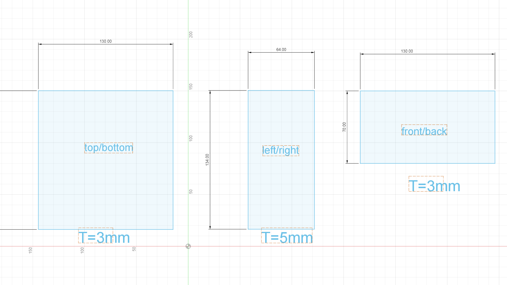
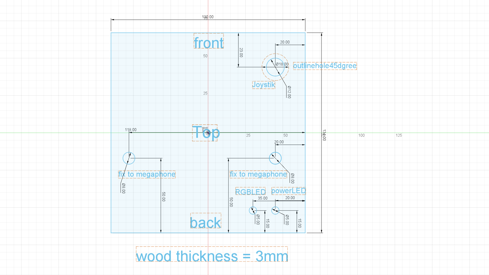
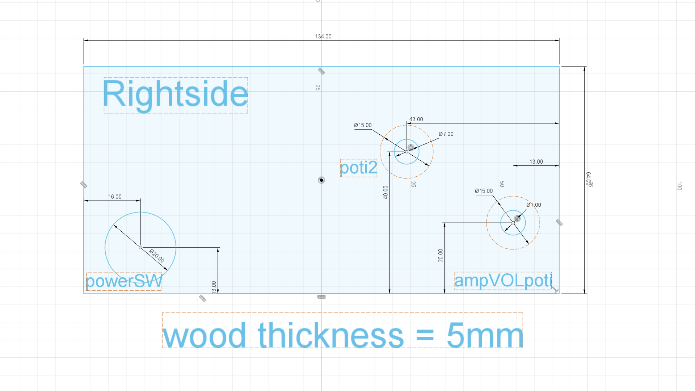
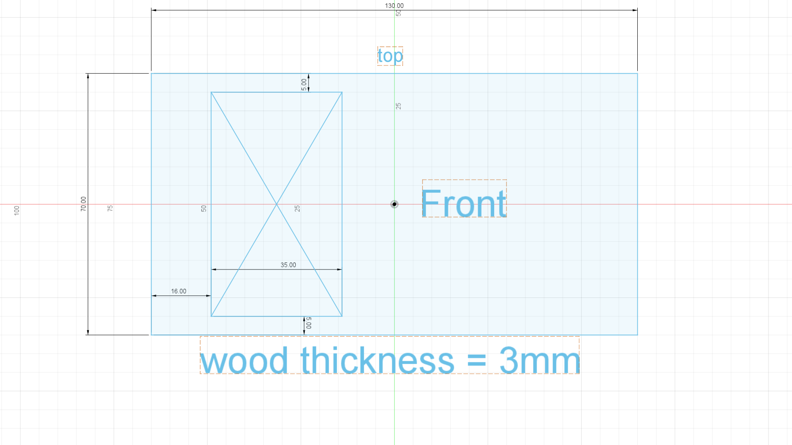

#  SomBat_2020 Box 
 
Houses the electronics.
made from 3 and 5 mm plywood; sawed or laser cut.

### Case dimensions

### Top 
houses
- 2 screw holes for fixing on Megaphone
- joystick
- RGB indicator LED
- Power LED

### Right panel
houses
- power switch
- Pot "Modulation" Pot (Raspi)
- Volume Pot (Amp)

### Front panel
houses
- switch board

