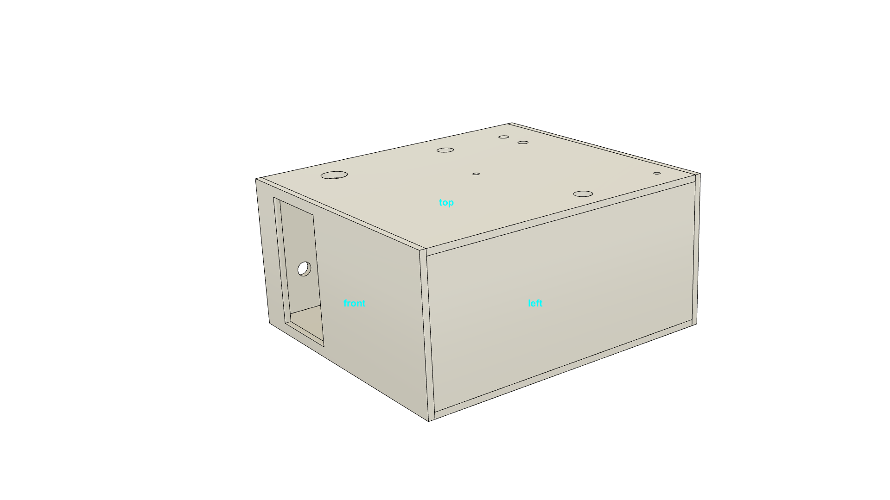

#  SomBat_2020 Box 
 
Houses the electronics.
made from 3 mm birch plywood; sawed/drilled or laser cut.

### ToDo	change: 
- joystick: move 1 box size backwards/inwards
- raspi: move 7mm outwards. 

Laser cut files (untested) are in subfolder /sombat2020_laser-cut

### Case dimensions

### Top 
houses

- joystick
- RGB indicator LED
- Power LED
- 2 7mm screw holes for fixing on Megaphone
- 4 3mm screw holes for fixing Raspi

### Right panel
houses

- power switch
- "Modulation" Pot (Raspi)
- Volume Pot (Amp)

### Front panel
houses

- switch board only

### Bottom panel
- exit for the speaker wire
- screws for Amp Board

### Mounting screws
2 x 6mm diam, 10mm long. 
