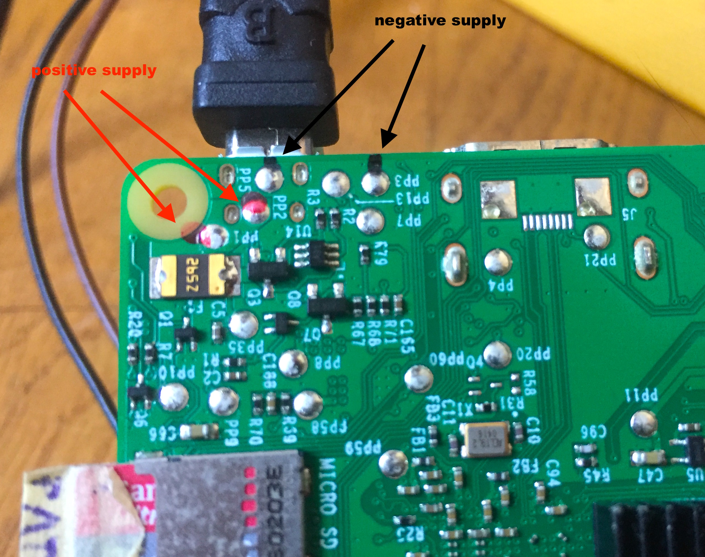
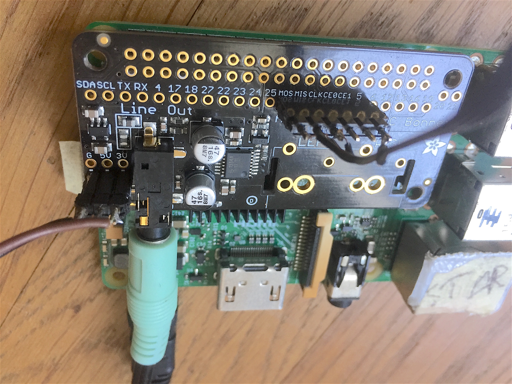
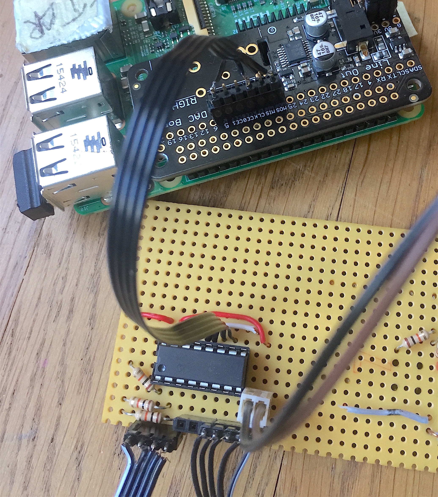
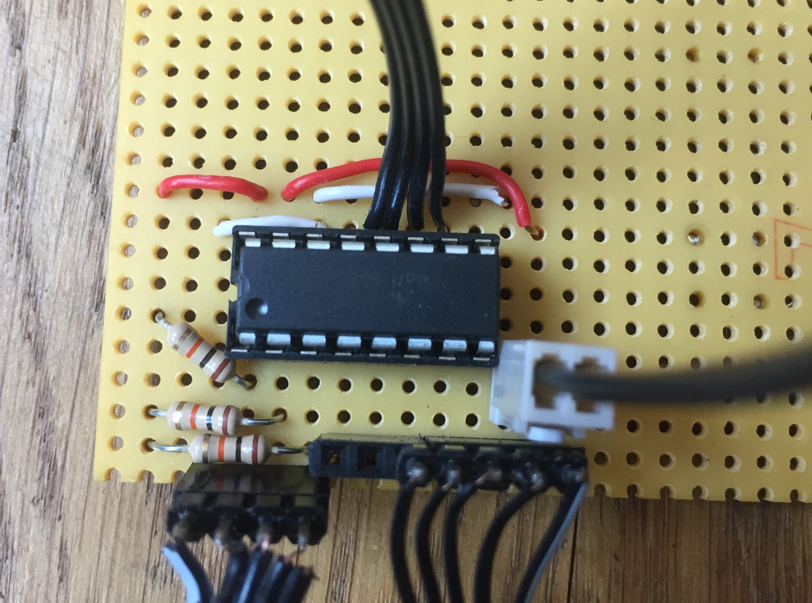
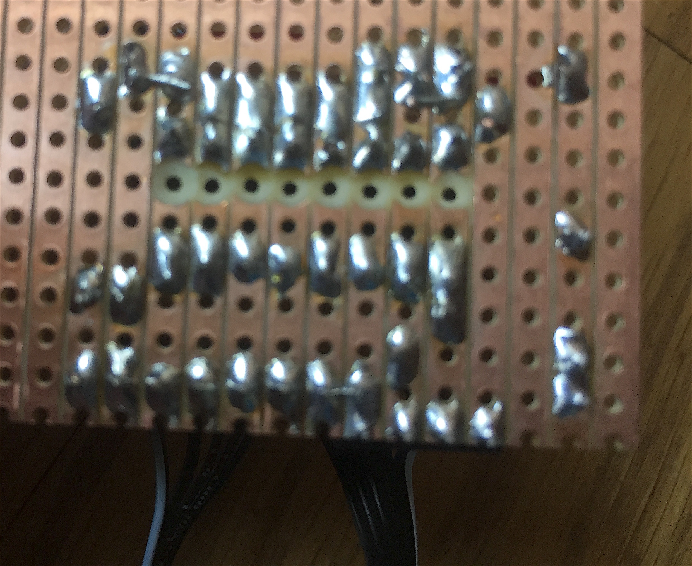
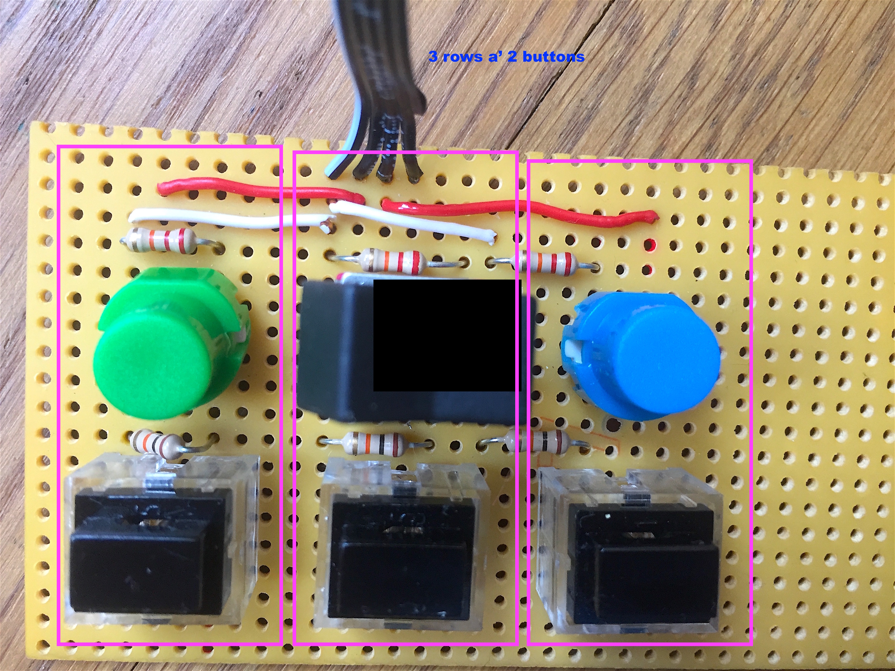
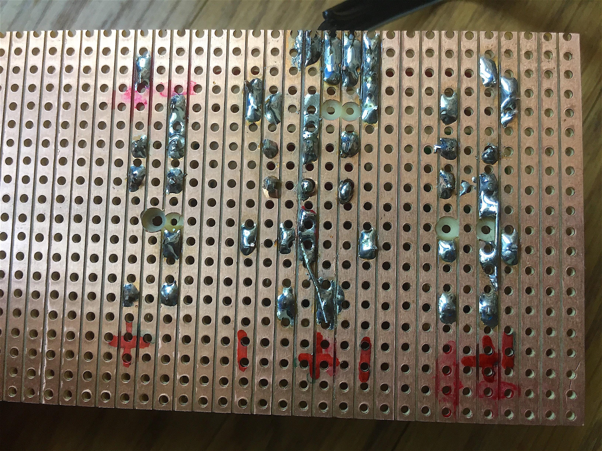
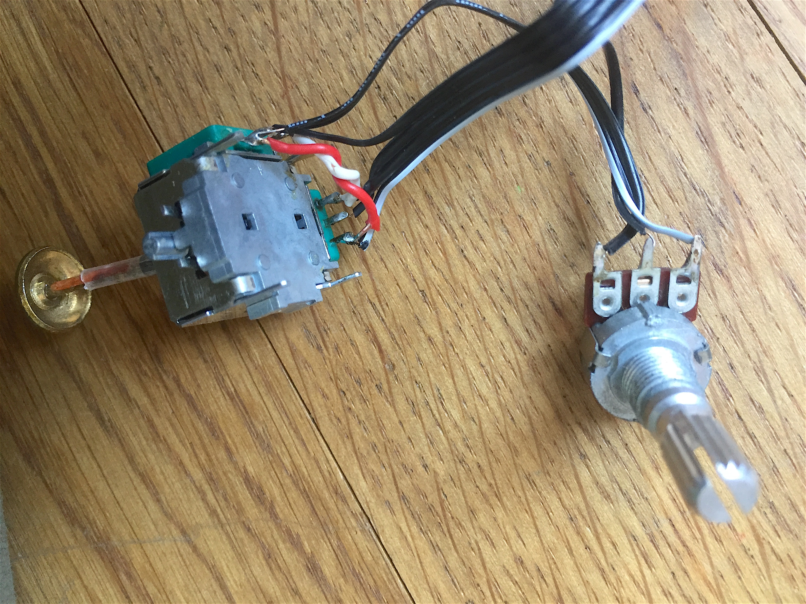

**// ToDo:**
- document LED wiring !
- track wiring precisely - otherwise Python code needs to be adapted for each individual item. 


DONE: 

add 1 RGB LED to 3 GPIO pins of Raspi: pins [23, 24, 25] on Audio Bonnet
add 1 R power LED across 5V
DONE:
	- write SC>OSC>Python code for LED. 
    - solid color for Synth mode
    - slowly blinking for Sample mode
    - hsv cycle thru the synth list / sample list in the respective modes. 


# SomBat_2020 - Hardware overview


### 1. entire system assembled
 


### 2. power section

- 8 AA Batteries > 12V, or 1.2V akkus > 9.6 V OK
- connect with 9V clip cable
- power switch thru + (red) line
- into Amp 
- parallel out from amp to Raspi's Step-Down power converter (based on XL4015) Trim output voltage to 5.0 V !


- converter 5V out to USB mico jack to Raspi in, or solder directy onto raspi board (careful!)




### 3. input subsys-overview

Audio Bonnet on Raspi accomodates pin headers for connecting 
- mcp3008 input board
- RGB LED (ToDo)


### 4. AudioBonnet wiring

- We connect a header row to:
[MOS, MIS, CLK, empty(CE0), empty(CE1), Pin5]
A 4 stranded flat wire goes to the mcp3008 board, as well as
- GND + 3.3V from pin triple near the audio jack. 



### 5. mcp3008-board-wiring

small interface board soldered on striped perfboard to connect mcp3008 with pin headers to interface elements AND SPI on AudioBonnet. 


	### chip Wiring mcp3008 ###
	# MCP3008 CLK to Pi SCLK
    # MCP3008 DOUT to Pi MISO
    # MCP3008 DIN to Pi MOSI
    # MCP3008 CS to Pi D5
    # MCP3008 VDD to Pi 3.3V
    # MCP3008 VREF to Pi 3.3V
    # MCP3008 AGND to Pi GND
    # MCP3008 DGND to Pi GND




- top side: 
````
PIN nr.	1   2   3   4   5   6   7   8		
		+,  +,  -,  MI, MO, CL, CS, -	
4 SPI lines to Raspi are miso, mosi, clk, chip Select (P5)

- bottom left: 3 analog lines + GND to switch board. Analog lines are pulled-up with 10k to +3.3V (red).
- bottom middle pins [4,5] not connected. 
- bottom right: 3 analog lines + 3.3V + GND to joystick/pot
- bottom far right: JST connector for power from Raspi
````


back side foto mirrors horizontally


### 6. input switches
Soldered on small vertically striped perfboard. 
Connects to mcp3008 with 4 wires only: gnd and 3 analog lines, each carrying signal for 2 switches. 


- upper middle switch is a 1P2T switch, rest are momentary buttons (keys), normally off. 
- lower 3 switches are connected to ground via 10k; 
- upper 3 switches are connected to ground via 22k. 
- all grounds are joined and brought back to mcp3008. 
- upper and lower button on each of the 3 rows: plus pole is connected to join into one of the 3 analog lines. 



kinda too complicated to explain... but simple in theory :) 
**ToDo: draw scematic**


### 7. analog controls
simply
- 1 analog 2-axis joystick and
- 1 linear pot (>= 10k)

- they the share + (red) and - (white) line, 
- and feed 3 analog signals back to the ADC.




#### -- e.o.f.--