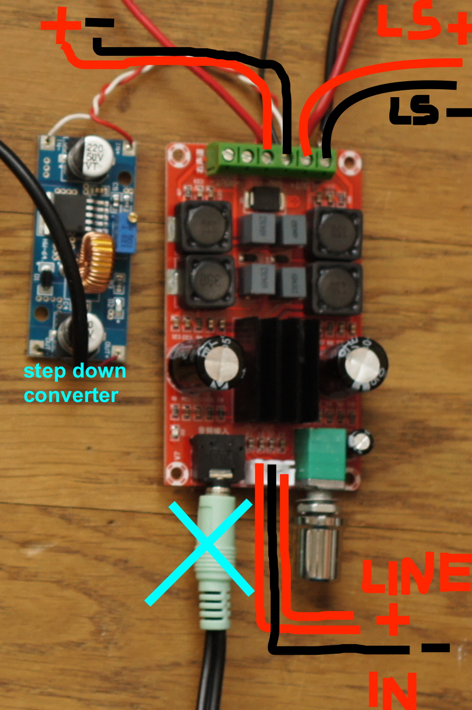
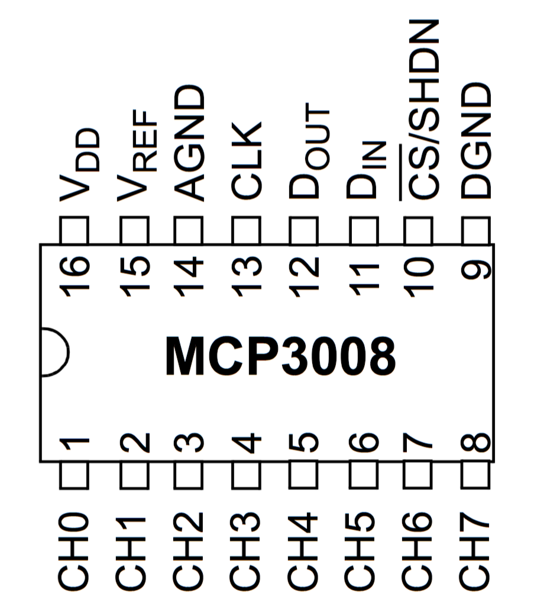

**// ToDo Fri:**


- [ ] raspi 177 mm nach links!
- [ ] doc minijack audio conn.

- [x] ADCs: solder all chans 4,5 to GND!
- [ ] glue stix f batt h.
- [x] add to Docu Box design from Isak
- [ ] assemble (clone) 1 other device to leave here
- [ ] prep. Linux !! 
- [ ] print Stickers 
	- round 7 cm diam. (back)
	- measure for rounding ones.

- [x] add 1 RGB LED to 3 GPIO pins of Raspi: pins [22, 24, 25] on Audio Bonnet
- [x] add 1 R power LED across 5V
- [x] document BOX !!
- [x] document LED wiring ! 
	[x] illu
	[x] Markdown
		led = RGBLED(25, 22, 24)
- [x] document Python depencdencies
- [x] track wiring precisely - otherwise Python code needs to be adapted for each individual item. 

- Package

	• main parts, counted parts 2-3-4 each: 
	- [ ] 2 x megaphone
	- [ ] 2 x soldered block: ADC
	- [ ] 2 x soldered block: Buttons
	- [x] 4 x RGB LEDs, Power LED, R's
	- [x] 2 x power switch
	- [x] 2 x step-down buck
	- [x] 2 x micro SD
	- [x] 2 x USB Memory chiavetta 
	- [x] 2 x Batt holder
	- [x] 2 x fem. header pin row
	- [x] 2 x ampli

	• accessories: 
	- [x] 2 x cable USB for power
	- [x] 2 x cable mini jack
	- [ ] 2 m generic cable
	- [ ] 4 x Pot heads
	- [x] 2 x screws


-----

## HW debugging:

### unit 1
- OK

### unit 2
- Switch input header mau!

### unit 3
- elektrsch 'interessant': 
- analogs OK
- switches: 
	- sw 1 no go
	- trig 2 ist auf toggle. 
- switchboard 5:
	- alles OK ausser Toggle zieht raw val auf 0!	

### unit 4
- ADC spricht nicht an - sendet nut 0en im raw test. 

### unit 5
- aehnl. wie unit 3:
- electrically OK, 
- HW reads other vals (R tolerances)

### unit 6
- can't test - no socket for ADC.

---

## Unit 5 Switch Board Tests 

Bd 1

Sw-bd 1 read vals *1000 	| row1|row3 *	|row2
----	|----|----|----
bot		| 32 | 32 |32
top		| -! | 45 |45
both	| 43 | 37 |26

**diag:** R1 and R3 in parallel


 -----
**Bd 2 - TOP !**

Sw-bd 2 read vals *1000 	| row1|row3	|row2
----	|----|----|----
bot		| 32 | 32 |32
top		| 45 | 45 |45
both	| 26 | 26 |26
 

 -----
Bd 3

Sw-bd 3 read vals *1000 	| row1|row3	|row2
----	|----|----|----
no		| 45 | 65 |65
bot		| 37 | 32 |32
top		| -! | 44 |44
both	| 26 | 26 |26
 
**diag**  row1Top as if NC - always closed
**therapy** swap button row1Top ? 


 -----
Bd 4

Sw-bd 4 read vals *1000 	| row1|row3	|row2
----	|----|----|----
no		| 65 | 3289 |65
bot		| 32 | 3283 |32
top		| 45 | 45 |44
both	| 26 | 26 |26
 
 *: row3Bot bleibt manchmal haengen > immer on >
 **Diag** ToDo replace switch !?!

 -----
Bd 5

Sw-bd 5 read vals *1000 	| row1|row3	|row2
----	|----|----|----
bot		| 32 | 43! |32
top		| 45 | 44 |45
both	| 26 | 26 |26
 
 **therapy:** drilled and OK 

 -----
Bd 6

Sw-bd 6 read vals *1000 	| row1|row3	|row2
----	|----|----|----
bot		| 32 | 43! |32
top		| 45 | 44 |45
both	| 26 | 26 |26
 
**therapy:** drilled and OK

-----
**ToDo:**
short all on 4/5 ANCs

next test row:
 - all joyst/pots on this ADC 5.
 - all ADCs to Sw. bd 2

----

**Healthy List:**

Nr.  	| ADC |Switches	|Analox|note
----	|----|----|----
1		| x | x | x
2		| x | x | x | ADC FIXED! > BXL
3		| x | - | - | ADC FIXED!
4		| x | - | x | ADC FIXED!
5		| x | x | x | ADC TOP!   > BXL
6		| - | x | - | 


-----


# SomBat_2020 - Hardware overview


### 1. entire system assembled
 


### 2. power section

- 8 AA Batteries > 12V, or 1.2V akkus > 9.6 V OK
- connect with 9V clip cable
- power switch thru + (red) line
- into Amp 
- parallel out from amp  to Raspi's Step-Down power converter (based on XL4015) Trim output voltage to 5.0 V !
- micro USB cable: use red and black for 5V and GND, resp.


- converter 5V out to USB mico jack to Raspi in, or solder directy onto raspi board (careful!)


### 3. Amp 

- Amp board takes 12V Power in from Batteries/Switch and passes on to the Step Down converter (left in img). 
- Line in is directly soldered or clipped from a minijack on AudioBonnet to the white JST connector between Minijack and volume pot on amp: minijack doesn't fit in the box, as vol. pot is drilled through to the case. 
- Speaker out thru screw terminal - use 1 chan (L) only!
- amp volume pot is brought outside from the box. it could be good to short the power-off switch on the pot, so the amp never gets muted while the system is on (poss. source of error).



### 4. input subsys-overview

Audio Bonnet on Raspi accomodates pin headers for connecting 
- mcp3008 input board (ADC Block)
- RGB LED, Power LED. 


### 5. AudioBonnet wiring

continued in section 8 for LEDs

- For connection to ADC Block, solder a fem. header row to:
[MOS, MIS, CLK, empty(CE0), empty(CE1), Pin5]
A 4 stranded flat wire goes to the mcp3008 board, as well as
- • GND and • +3.3V from power pin triple near the audio jack. 


### 6. ADC Block wiring

small interface board soldered on striped perfboard (aka stripboard) to connect mcp3008 with pin headers to interface elements and power/SPI on AudioBonnet. 




	### chip Wiring mcp3008 ###
	# MCP3008 CLK to Pi SCLK
    # MCP3008 DOUT to Pi MISO
    # MCP3008 DIN to Pi MOSI
    # MCP3008 CS to Pi D5
    # MCP3008 VDD to Pi 3.3V
    # MCP3008 VREF to Pi 3.3V
    # MCP3008 AGND to Pi GND
    # MCP3008 DGND to Pi GND


 	top row:
	PIN nr.	1   2   3   4   5   6   7   8		
			+,  +,  -,  MI, MO, CL, CS, -	
	4 SPI lines to Raspi are miso, mosi, clk, chip Select (P5)

	bottom row:
	- bottom left: 3 analog lines + GND to switch board. Analog lines are pulled-up with 10k to +3.3V (red).
	- bottom middle pins [4,5] not connected. 
	- bottom right: 3 analog lines + 3.3V + GND to pot, joystick Y, joystick X
	- bottom far right: GND, +3.3V power from Raspi

so, digitized inputs appear (in Python) as chans: 

	1		2		3		4		5		6		7		8
	sw 		sw 		sw 		pull 	pull	pot 	JY  	JX
	row1 	row3  	row2  	to GND 	to GND


back side, mirrored horizontally


### 7. Input Switches
Soldered on small vertically striped perfboard. 
Connects to mcp3008 ADC Block with 4 wires only: GND and 3 analog lines, each carrying signal for 2 switches. 


- upper middle switch is a 1P2T switch, left foot unconnected; others are momentary buttons (keys), normally off. 
- lower 3 switches are connected to ground via 10k; 
- upper 3 switches are connected to ground via 22k. 
- all grounds are joined and brought back to mcp3008. 
- upper and lower button on each of the 3 rows: plus pole is connected to join into one of the 3 analog lines. 


### 8. analog controls
- 1 analog 2-axis joystick and
- 1 linear pot (>= 5k)
- they the share + (red) and - (white) line, 
- and feed 3 analog signals back to the ADC pins like this:
	- 6: Pot
	- 7: Joy Y
	- 8: Joy X

Joystick's correct position on box is:

- both green things pointing to South-West (backwards & left) when viewed from above!


### 9. LEDs & cabling
Common Cathode RGB LED
Connect to Raspi's GND, 25, 22, 24 for RGB Anodes. 
````
Tell LED Pins by leg lengths: 
–––––    R
–––––––   GND
–––––    G
–––     B
````


#### -- e.o.f.--